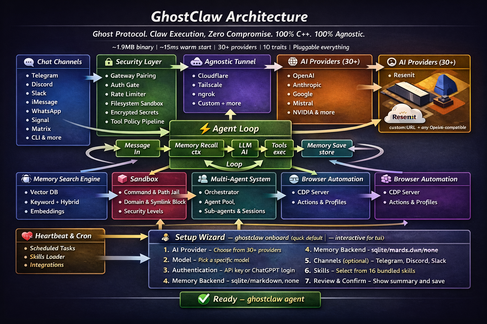

<div align="center">


# GhostClaw 🦀

</div>

<div align="center">

**Ghost Protocol. Claw Execution. Zero Compromise. 100% C++. 100% Agnostic.**

👑 **Grandfather of OpenClaw**
✨ **Smallest and Fastest Feature-Complete Implementation of OpenClaw**
🌐 **First C++ Agent Framework with Native Conway Cloud / x402 Integration**

⚡ Runs on $10 hardware with ~10MB RAM and a ~2MB binary — 99% less memory than OpenClaw

[](LICENSE)

</div>

<div align="center">

Fast, small, and fully autonomous AI assistant infrastructure — deploy anywhere, swap anything.

`~1.9MB binary` · `~20ms warm start` · `30+ providers` · `10 traits` · `Conway Cloud native` · `Self-evolving agent`

</div>

## ✨ Features

<div align="center">

|     🪶 **Ultra-Lightweight**     |        ⚡ **Lightning Fast**        |  🚀 **True Portability**   |
| :------------------------------: | :---------------------------------: | :------------------------: |
| ~2MB peak footprint<br>~10MB RSS | 20ms warm start<br>240ms cold start | Single binary<br>ARM + x86 |

|            🔄 **Fully Swappable**             |           🔓 **No Lock-in**           |          🔒 **Secure by Design**          |
| :-------------------------------------------: | :-----------------------------------: | :---------------------------------------: |
| Trait-based architecture<br>Zero code changes | 30+ AI providers<br>OpenAI-compatible | Pairing + sandboxing<br>Workspace scoping |

|           🌐 **Conway Cloud Native**           |        🧬 **Self-Evolving**         |        🔮 **Sovereign Operation**         |
| :--------------------------------------------: | :---------------------------------: | :---------------------------------------: |
| Spin up VMs, deploy apps<br>x402 USDC payments | SOUL.md living identity<br>Skill IQ | Autonomous skill install<br>Tool profiler |

</div>

---

## 🎯 Why Teams Pick GhostClaw

<table>
<tr>
<td width="50%">

### 🏗️ **Production Ready**

- ⚡ Small C++ binary, fast startup
- 🔒 Pairing, strict sandboxing, allowlists
- 📦 Single self-contained binary
- 🔄 Trait-based, fully swappable

</td>
<td width="50%">

### 🚀 **Feature Rich**

- 🤖 30+ AI provider integrations
- 💬 10+ real messaging channels
- 🌐 Browser automation built-in
- 🎨 Canvas, voice, TTS support

</td>
</tr>
<tr>
<td width="50%">

### 🌐 **Conway Cloud Integration** _(New)_

- 🖥️ Spawn Linux VMs via Conway Compute
- 🌍 Buy and manage domains autonomously
- 💸 x402 machine-to-machine USDC payments
- 🔑 Auto-inject `conway-terminal` MCP server

</td>
<td width="50%">

### 🧬 **Self-Evolving Agent** _(New)_

- 📜 `SOUL.md` living identity that grows over time
- 🎯 `skill_discover` / `skill_auto_install` / `skill_create`
- 📊 Tool usage profiler with `self_optimize`
- 💓 Survival tier heartbeat monitoring

</td>
</tr>
</table>

---

## 📊 Benchmark Snapshot (GhostClaw vs OpenClaw)

<div align="center">

Local machine quick benchmark (macOS arm64, Feb 2026) normalized for 0.8GHz edge hardware.

</div>

|                    | **OpenClaw**  |  **NanoBot**   |  **PicoClaw**   |   **ZeroClaw**   |   **GhostClaw** 🐾   |
| ------------------ | :-----------: | :------------: | :-------------: | :--------------: | :------------------: |
| **Language**       |  TypeScript   |     Python     |       Go        |       Rust       |       **C++**        |
| **RAM**            |     > 1GB     |    > 100MB     |     < 10MB      |      < 5MB       |      **~10MB**       |
| **Startup (warm)** |    > 500ms    |     > 30ms     |     < 100ms     |      < 10ms      |      **~20ms**       |
| **Cold Start**     |     > 5s      |      > 1s      |      < 1s       |      ~440ms      |      **~240ms**      |
| **Binary Size**    | ~28MB (dist)  | N/A (Scripts)  |      ~8MB       |      ~3.4MB      |      **1.9MB**       |
| **Cost**           | Mac Mini $599 | Linux SBC ~$50 | Linux Board $10 | Any hardware $10 | **Any hardware $10** |

> **Notes:** GhostClaw results measured with `/usr/bin/time -l` on release builds. OpenClaw requires Node.js runtime (~390MB overhead). PicoClaw and ZeroClaw are static binaries. GhostClaw has the **smallest binary** and **fastest cold start**.

<details>
<summary><b>📈 Detailed GhostClaw Measurements</b></summary>

<br>

```
                    GhostClaw v0.2.0 — Release Build
  ─────────────────────────────────────────────────────────

  BINARY          1,989,792 bytes stripped (1.9 MB)
                  2,406,968 bytes unstripped (2.3 MB)

  STARTUP         ~20ms warm   (median of 20 runs, --help)
                  ~240ms pseudo-cold  (fresh binary path, median of 10 runs)

  MEMORY          ~1.9 MB peak footprint  (process-only, --version)
                  ~4.9 MB peak footprint  (doctor, full diagnostics)
                  ~9.5 MB RSS             (includes shared system dylibs)

  ─────────────────────────────────────────────────────────
  Measured Feb 20 2026 · /usr/bin/time -lp + gettimeofday() wrapper
```

</details>

<details>
<summary><b>Reproduce these numbers yourself</b></summary>

<br>

```bash
cmake -S . -B build -DCMAKE_BUILD_TYPE=Release
cmake --build build -j

# Binary size
strip -o ghostclaw-stripped build/ghostclaw
ls -lh ghostclaw-stripped

# Memory + timing (single run)
/usr/bin/time -lp ./build/ghostclaw --version

# Warm start (run a few times to warm cache, then measure 20)
for i in {1..20}; do /usr/bin/time -lp ./build/ghostclaw --version 2>&1 | grep "^real"; done

# Cold start (macOS — requires sudo)
sudo purge && /usr/bin/time -lp ./build/ghostclaw --version
```

**Warm** = 20 consecutive runs, median. **Cold** = fresh binary copy + 512MB random write to flush page cache between runs, median of 10. RSS and footprint from `/usr/bin/time -lp`.

</details>

---

## 🚀 Quick Start

```bash
git clone https://github.com/sudiprokaya/GhostClaw.git
cd GhostClaw
cmake -S . -B build -DCMAKE_BUILD_TYPE=Release
cmake --build build -j

# Just run it — the setup wizard launches automatically on first run
./build/ghostclaw
```

<div align="center">

**The wizard walks you through provider, model, API key, memory, channels, and skills in 7 steps,<br>then offers to drop you straight into the agent.**

</div>

### 💡 Usage Examples

```bash
# Skip the wizard entirely with flags
ghostclaw onboard --provider openrouter --api-key sk-...

# Single message
ghostclaw agent -m "Hello, GhostClaw!"

# Interactive chat
ghostclaw agent

# Start the gateway (webhook server)
ghostclaw gateway

# Start full autonomous daemon
ghostclaw daemon

# Diagnostics
ghostclaw status
ghostclaw doctor
```

### 🌐 Conway Cloud — Sovereign Operation

```bash
# Connect your Conway account
ghostclaw conway setup --api-key <YOUR_CONWAY_API_KEY>

# Check survival tier and credit balance
ghostclaw conway status

# Spin up a VM, deploy an app, or buy a domain — the agent does it
ghostclaw agent -m "Deploy a Node.js app on Conway Cloud and register a .xyz domain"

# Enable full sovereign mode (SOUL.md + skill IQ + survival heartbeat)
ghostclaw sovereign start
ghostclaw sovereign status
ghostclaw sovereign evolve    # trigger a manual evolution cycle
```

> Once `conway.enabled = true` and an API key is set, GhostClaw **automatically** injects `conway-terminal` as an MCP server — no extra config required.

### 🧬 SOUL.md — Living Agent Identity

GhostClaw agents can write, read, and evolve their own `SOUL.md` identity document using built-in soul tools:

```
soul_read      — read the current SOUL.md
soul_update    — update a named section (name, purpose, values, …)
soul_reflect   — append a timestamped reflection entry
```

The file is git-versioned automatically on every update, giving you a full history of how the agent evolved.

### 🐳 Docker

```bash
docker build -t ghostclaw .
docker run --rm ghostclaw --help
docker run -d --name ghostclaw-daemon -p 8080:8080 ghostclaw daemon --host 0.0.0.0 --port 8080
```

---

## 🏗️ Architecture

<div align="center">

**Every subsystem is a trait — swap implementations with a config change, zero code changes.**

</div>

<div align="center">



</div>

<details>
<summary><b>📋 View Subsystem Details</b></summary>

| Subsystem            | Trait          | Ships with                                                                                                                                                                                                                             | Extend                                                    |
| -------------------- | -------------- | -------------------------------------------------------------------------------------------------------------------------------------------------------------------------------------------------------------------------------------- | --------------------------------------------------------- |
| 🤖 **AI Models**     | Provider       | 30+ providers (OpenRouter, Anthropic, OpenAI, Google, Ollama, Groq, Cerebras, Mistral, xAI, DeepSeek, Together, Fireworks, NVIDIA, Cloudflare, HuggingFace, etc.)                                                                      | `custom:https://your-api.com` — any OpenAI-compatible API |
| 💬 **Channels**      | Channel        | CLI, Telegram, Discord, Slack, iMessage, Matrix, WhatsApp, Signal, Webhook                                                                                                                                                             | Any messaging API                                         |
| 🧠 **Memory**        | Memory         | SQLite with hybrid search (FTS5 + vector cosine similarity), Markdown                                                                                                                                                                  | Any persistence backend                                   |
| 🛠️ **Tools**         | Tool           | shell, file_read, file_write, memory_store, memory_recall, memory_forget, browser_open, web_search, canvas, soul_read, soul_update, soul_reflect, skill_discover, skill_auto_install, skill_create, tool_profile_report, self_optimize | Any capability                                            |
| 📊 **Observability** | Observer       | Noop, Log, Multi                                                                                                                                                                                                                       | Prometheus, OTel                                          |
| ⚙️ **Runtime**       | RuntimeAdapter | Native (Mac/Linux)                                                                                                                                                                                                                     | Docker (planned)                                          |
| 🔒 **Security**      | SecurityPolicy | Gateway pairing, sandbox, allowlists, rate limits, filesystem scoping, encrypted secrets, tool policy groups (conway, soul, profiler)                                                                                                  | —                                                         |
| 👤 **Identity**      | IdentityConfig | OpenClaw (markdown), AIEOS v1.1 (JSON), SOUL.md (self-authored, git-versioned)                                                                                                                                                         | Any identity format                                       |
| 🌐 **Tunnel**        | Tunnel         | None, Cloudflare, Tailscale, ngrok, Custom                                                                                                                                                                                             | Any tunnel binary                                         |
| 🎯 **Skills**        | Loader         | TOML manifests + SKILL.md instructions                                                                                                                                                                                                 | Community skill packs, autonomous skill install           |
| ☁️ **Conway Cloud**  | McpServer      | conway-terminal MCP (auto-injected): Compute, Domains, x402 USDC payments                                                                                                                                                              | Any Conway API endpoint                                   |
| 💓 **Survival**      | Heartbeat      | Survival tier monitoring (normal / low_compute / critical / dead), cron-based balance checks                                                                                                                                           | Custom survival strategies                                |

</details>

---

## 🧠 Memory System

<div align="center">

**All custom, zero external dependencies — no Pinecone, no Elasticsearch, no LangChain**

</div>

| Layer              | Implementation                                                |
| ------------------ | ------------------------------------------------------------- |
| **Vector DB**      | Embeddings stored as BLOB in SQLite, cosine similarity search |
| **Keyword Search** | FTS5 virtual tables with BM25 scoring                         |
| **Hybrid Merge**   | Custom weighted merge function                                |
| **Embeddings**     | EmbeddingProvider trait — OpenAI, local, or noop              |
| **Chunking**       | Line-based markdown chunker with heading preservation         |
| **Caching**        | SQLite embedding_cache table with LRU eviction                |

```toml
[memory]
backend = "sqlite"          # "sqlite", "markdown", "none"
auto_save = true
embedding_provider = "openai"
vector_weight = 0.7
keyword_weight = 0.3
```

---

## 🔒 Security

<div align="center">

**GhostClaw enforces security at every layer**

</div>

| #   | Item                         | Status | How                                                                                               |
| --- | ---------------------------- | :----: | ------------------------------------------------------------------------------------------------- |
| 1   | Gateway not publicly exposed |   ✅   | Binds 127.0.0.1 by default. Refuses 0.0.0.0 without tunnel or explicit `allow_public_bind = true` |
| 2   | Pairing required             |   ✅   | 6-digit one-time code on startup. Exchange via POST /pair for bearer token                        |
| 3   | Filesystem scoped            |   ✅   | `workspace_only = true` by default. System dirs blocked. Symlink escape detection                 |
| 4   | Access via tunnel only       |   ✅   | Gateway refuses public bind without active tunnel                                                 |

---

## ⚙️ Configuration

<div align="center">

Config: `~/.ghostclaw/config.toml` (created automatically on first run)

</div>

<details>
<summary>📝 <b>View Example Configuration</b></summary>

```toml
api_key = "sk-..."
default_provider = "openrouter"
default_model = "anthropic/claude-sonnet-4-20250514"
default_temperature = 0.7

[memory]
backend = "sqlite"
auto_save = true
embedding_provider = "openai"

[gateway]
require_pairing = true
allow_public_bind = false

[autonomy]
level = "supervised"            # "readonly", "supervised", "full"
workspace_only = true
allowed_commands = ["git", "npm", "cargo", "ls", "cat", "grep"]

[tunnel]
provider = "none"               # "none", "cloudflare", "tailscale", "ngrok", "custom"

[secrets]
encrypt = true

[browser]
enabled = false
allowed_domains = ["docs.rs"]

# Conway Cloud — sovereign operation (new)
[conway]
enabled = true
api_key = ""                         # or set CONWAY_API_KEY env var
wallet_path = "~/.conway/wallet.json"
survival_monitoring = true
low_compute_threshold_usd = 0.50
critical_threshold_usd = 0.10

# Self-evolving SOUL.md identity (new)
[soul]
enabled = true
path = "SOUL.md"
git_versioned = true
max_reflections = 100
protected_sections = ["identity", "core_values"]
```

</details>

<div align="center">

📚 **Full reference:** [docs/CONFIGURATION.md](docs/CONFIGURATION.md)

</div>

---

## 🎮 Commands

<table>
<tr>
<td width="50%">

### Core Commands

| Command                | Description                 |
| ---------------------- | --------------------------- |
| _(no args, first run)_ | Auto-launches 7-step wizard |
| `onboard`              | Re-run setup wizard         |
| `onboard --provider X` | Non-interactive setup       |
| `agent`                | Interactive chat mode       |
| `agent -m "..."`       | Single message mode         |
| `gateway`              | Start HTTP gateway          |
| `daemon`               | Start autonomous daemon     |

</td>
<td width="50%">

### Management Commands

| Command                      | Description               |
| ---------------------------- | ------------------------- |
| `service install/start/stop` | Manage background service |
| `doctor`                     | Run diagnostics checks    |
| `status`                     | Show system status        |
| `channel doctor`             | Check channel health      |
| `cron`                       | Manage scheduler jobs     |
| `skills`                     | Manage skill packages     |
| `tts`                        | Text-to-speech providers  |
| `voice`                      | Wake-word utilities       |
| `integrations`               | Browse registry           |

</td>
</tr>
<tr>
<td width="50%">

### Conway Commands _(New)_

| Command         | Description                         |
| --------------- | ----------------------------------- |
| `conway setup`  | Connect Conway account & API key    |
| `conway status` | Show survival tier & credit balance |
| `conway fund`   | Add credits to Conway wallet        |

</td>
<td width="50%">

### Sovereign Commands _(New)_

| Command            | Description                        |
| ------------------ | ---------------------------------- |
| `sovereign start`  | Activate full sovereign agent mode |
| `sovereign status` | Show SOUL.md + survival + skill IQ |
| `sovereign evolve` | Trigger manual evolution cycle     |
| `sovereign stop`   | Deactivate sovereign mode          |

</td>
</tr>
</table>

---

## 🛠️ Development

```bash
# Debug build + tests
cmake -S . -B build -DCMAKE_BUILD_TYPE=Debug
cmake --build build -j
ctest --test-dir build --output-on-failure

# Release build
cmake -S . -B build-release -DCMAKE_BUILD_TYPE=Release
cmake --build build-release -j

# Run benchmarks
./build/benches/ghostclaw_benchmarks
```

---

## 🤝 Contributing

<div align="center">

See [CONTRIBUTING.md](CONTRIBUTING.md). Implement a trait, submit a PR:

</div>

<table>
<tr>
<td width="50%">

- 🤖 **New Provider** → `src/providers/`
- 💬 **New Channel** → `src/channels/`
- 📊 **New Observer** → `src/observability/`
- 🛠️ **New Tool** → `src/tools/`

</td>
<td width="50%">

- 🧠 **New Memory** → `src/memory/`
- 🌐 **New Tunnel** → `src/tunnel/`
- 🎯 **New Skill** → `~/.ghostclaw/workspace/skills/<name>/`
- 🌐 **Conway Module** → `src/conway/`
- 📜 **Soul Module** → `src/soul/`
- 📊 **Profiler** → `src/profiler/`

</td>
</tr>
</table>

---

## 📄 License

<div align="center">

MIT — see [LICENSE](LICENSE)

</div>

---

<div align="center">

**GhostClaw — Ghost Protocol. Claw Execution. Zero Compromise.** 🦀

</div>
